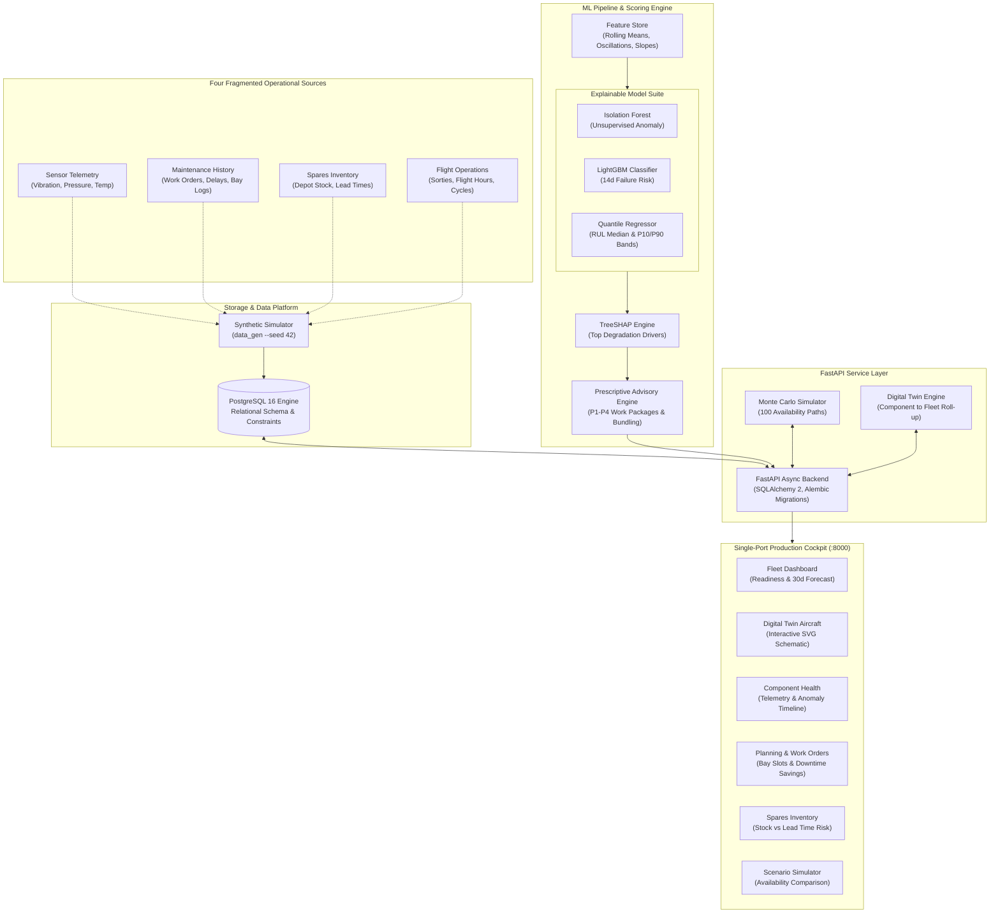

# AeroPulse — Integrated Predictive Maintenance & Fleet Availability Platform

[](https://www.python.org/)
[](https://fastapi.tiangolo.com)
[](https://react.dev/)
[](https://www.typescriptlang.org/)
[](https://www.postgresql.org/)
[](#synthetic-data-declaration)
[-success.svg)](#native-development-philosophy)

An end-to-end decision-support platform engineered for military aviation fleet availability. It synthesizes four traditionally siloed operational streams—**flight sensor telemetry, technical maintenance logbooks, spares supply-chain inventory, and maintenance workshop bay capacity**—into an automated, explainable predictive maintenance and fleet readiness system.

> **Problem Statement 26249 (MoD / DSSC):**  
> *"Low aircraft availability due to fragmented and largely reactive maintenance practices across the air fleet."*

---

## Synthetic Data Declaration

> [!IMPORTANT]
> **ALL DATA IN THIS REPOSITORY AND APPLICATION IS 100% SYNTHETIC.**  
> - Uses generic aircraft designations (*Generic Twin-Engine Transport*, tail numbers `AC-001` through `AC-040`).
> - No real aircraft types, military units, operational deployments, proprietary telemetry, or weapons systems are included.
> - Strictly designed for maintenance decision-support and fleet availability analytics.
> - See [docs/limitations.md](docs/limitations.md) for detailed modeling assumptions and data boundaries.

---

## System Architecture

AeroPulse breaks down data silos by joining telemetry streams, maintenance history, and inventory availability into a unified PostgreSQL schema, scored by an explainable ML pipeline, and presented via a high-performance React operational cockpit:



---

## One-Command Reproducible Local Demo

Execute the entire end-to-end lifecycle—schema migrations, synthetic data generation, ML training, scoring engine execution, frontend production build, and unified single-port hosting—with a single native command:

```bash
python scripts/tasks.py demo
```

Once execution completes, open your browser to:
```
http://localhost:8000
```
- **Web Cockpit**: `http://localhost:8000` (serving pre-compiled production SPA)
- **Interactive Swagger Docs**: `http://localhost:8000/docs`
- **System Health Check**: `http://localhost:8000/api/v1/health`
- **Demo Walkthrough**: Follow [docs/demo-script.md](docs/demo-script.md) for the complete 11-step hero scenario (`AC-017` hydraulic pump degradation).

---

## Native Local Setup (No Containers / No Docker)

Per project design rules, AeroPulse runs 100% natively on your development machine (Windows, macOS, Linux) with zero container overhead.

### 1. Prerequisites
- **Python 3.11+**
- **Node.js 20+** and `npm`
- **PostgreSQL 16** natively installed and running

For operating system specifics, refer to [docs/local-setup.md](docs/local-setup.md).

### 2. Database Initialization
Provision the local role and database using standard PostgreSQL credentials:
```bash
# As postgres superuser
psql -U postgres -p 5432 -f database/setup_local.sql
```

### 3. Environment & Dependencies
```bash
# 1. Configure environment variables
cp .env.example .env

# 2. Setup Python virtual environment
python -m venv .venv
# On Windows (PowerShell):
.\.venv\Scripts\Activate.ps1
# On macOS/Linux:
source .venv/bin/activate

# 3. Install Python dependencies
pip install -r requirements-dev.txt

# 4. Install Frontend dependencies
cd frontend && npm install && cd ..
```

### 4. Running Development Servers
To develop with live hot-reloading across both backend and frontend:
```bash
python scripts/tasks.py dev
```
- Frontend Dev Server: `http://localhost:5173`
- Backend API Server: `http://127.0.0.1:8000`

---

## Cross-Platform Task Runner (`scripts/tasks.py`)

No `make` or shell-specific dependencies are required. Use `python scripts/tasks.py <command>`:

| Command | Action |
|---|---|
| `python scripts/tasks.py demo` | **Full Reproducible Demo**: Migrates, seeds seed 42, trains models, runs engine, builds frontend, and serves unified application at `:8000`. |
| `python scripts/tasks.py dev` | Starts uvicorn backend and Vite dev server concurrently with graceful `Ctrl+C` shutdown. |
| `python scripts/tasks.py build` | Compiles the production frontend bundle into `frontend/dist`. |
| `python scripts/tasks.py test` | Executes full backend test suite (`pytest`) and frontend test suite (`vitest`). Pass `--e2e` for Playwright walkthrough. |
| `python scripts/tasks.py lint` | Runs `ruff check`, `ruff format --check`, and frontend `eslint`. |
| `python scripts/tasks.py migrate` | Applies Alembic schema migrations to local PostgreSQL. |
| `python scripts/tasks.py seed` | Generates reproducible synthetic fleet data (`--seed 42`). |
| `python scripts/tasks.py train` | Trains offline ML models (Isolation Forest, LightGBM risk, RUL quantile regressors). |
| `python scripts/tasks.py engine` | Runs predictive maintenance scoring engine CLI generating advisories and alerts. |

---

## 11-Step Hero Scenario Walkthrough

The platform features a scripted degradation arc on hero aircraft **`AC-017`** (hydraulic main pump cavitation with tight depot spare stock):

| Step | Page | Key Finding / Action | Expected Result |
|---|---|---|---|
| **1. Fleet Dashboard** | `/dashboard` | Inspect readiness KPIs and heatgrid | Availability ~82.5%, 30d forecast dropping to ~74%; `AC-017` Hydraulics amber. |
| **2. Spot the Issue** | `/aircraft` | Inspect airframe schematic for `AC-017` | Subsystem health index dropped from 68 to 41; hydraulic main pump highlighted. |
| **3. Sensor Trends** | `/components` | Examine pump telemetry oscillations | Increasing pressure oscillations & +12°C thermal drift; static thresholds not tripped. |
| **4. Anomaly Timeline** | `/components` | Inspect ML anomaly detector | Sustained anomaly flagged **~19 days before physical failure**. |
| **5. Failure Risk & RUL** | `/components` | Check probabilistic predictions | Risk elevated to 0.62; RUL estimated at 12 days (P10–P90 band: 7–19 days). |
| **6. Prescriptive Advisory** | `/components` | Review automated advisory card | Priority P2: "Replace within 7 days", backed by TreeSHAP feature attribution. |
| **7. Spares Inventory** | `/spares` | Cross-reference stock and lead time | 1 pump in depot; 45-day OEM lead time; second airframe `AC-023` also wearing. |
| **8. Bay Scheduling** | `/planning` | Propose bundled maintenance slot | Bundled with upcoming 50-hour routine inspection; Bay 2 slot assigned. |
| **9. Availability Impact** | `/planning` | Compare downtime alternatives | Replace now: -2.5 aircraft-days vs. Run-to-failure: -9.0 aircraft-days (+6.5d saved). |
| **10. Scenario Simulator** | `/scenarios` | Side-by-side Monte Carlo comparison | Proactive policy preserves 81.8% availability vs 74.1% baseline across 100 paths. |
| **11. Close & Summary** | `/dashboard` | Review unified decision loop | Demonstrates complete transition from reactive panic to proactive engineering. |

For the complete presenter script with exact dialogue and user actions, see [docs/demo-script.md](docs/demo-script.md).

---

## Visual Cockpit Interface Placeholders

```
+----------------------------------------------------------------------------------------------------+
| [Screenshot 1: Fleet Operational Cockpit]                                                          |
| docs/screenshots/dashboard.png                                                                     |
| Key Elements: Fleet Availability (82.5%), 30-Day Forecast Trend, Subsystem Healthgrid Heatmap      |
+----------------------------------------------------------------------------------------------------+
| [Screenshot 2: Digital Twin & Interactive Airframe Schematic]                                      |
| docs/screenshots/aircraft-twin.png                                                                 |
| Key Elements: SVG Aircraft Schematic, AC-017 Hydraulics Degradation (HI: 41), Component Roll-up    |
+----------------------------------------------------------------------------------------------------+
| [Screenshot 3: Component Health & Multi-Sensor Telemetry]                                          |
| docs/screenshots/component-health.png                                                              |
| Key Elements: Outlet Pressure Oscillations, Fluid Temperature Drift, Anomaly Detection Timeline   |
+----------------------------------------------------------------------------------------------------+
| [Screenshot 4: Explainable AI Advisory with TreeSHAP Attributions]                                 |
| docs/screenshots/prescriptive-advisory.png                                                         |
| Key Elements: Priority P2 Card, Actionable Replacement Window, SHAP Physical Impact Breakdown      |
+----------------------------------------------------------------------------------------------------+
| [Screenshot 5: Spares Inventory & Lead-Time Risk Matrix]                                           |
| docs/screenshots/spares-inventory.png                                                              |
| Key Elements: Stock Levels, 45-Day Lead Time Scatter Plot, Fleet Shortfall Horizon Warnings        |
+----------------------------------------------------------------------------------------------------+
| [Screenshot 6: Monte Carlo Availability Scenario Simulator]                                        |
| docs/screenshots/scenario-simulator.png                                                            |
| Key Elements: Three Side-by-Side Simulation Runs (Baseline vs Proactive vs Stockout), Fan Charts   |
+----------------------------------------------------------------------------------------------------+
```

---

## Key Documentation Index

- **Demo Script**: [docs/demo-script.md](docs/demo-script.md) — 11-step click-by-click presenter guide.
- **System Limitations & Real-World Realities**: [docs/limitations.md](docs/limitations.md) — Synthetic data boundary disclosures, model assumptions, and DO-178C airworthiness considerations.
- **Data Dictionary**: [docs/data-dictionary.md](docs/data-dictionary.md) — Complete relational schema, tables, column definitions, and constraints.
- **Security Checklist**: [docs/security-checklist.md](docs/security-checklist.md) — RBAC authentication, JWT tokens, parameter sanitization, and audit logging.
- **Model Evaluation Report**: [reports/model_evaluation.md](reports/model_evaluation.md) — Full evaluation metrics (ROC-AUC, PR-AUC, RMSE, calibration plots).
- **Native Local Setup**: [docs/local-setup.md](docs/local-setup.md) — OS-specific native installation guidelines.

---

## Defense Scope & Security Disclaimer

AeroPulse is designed strictly as an engineering and logistics **decision-support platform**:
- It does **not** provide operational combat flight planning, weapons assignment, or tactical mission dispatch.
- Automated advisories are **recommendations only**; human-in-the-loop authorization by a certified technical officer is required prior to scheduling maintenance.
- All code, datasets, and models are entirely unclassified and synthetic.
